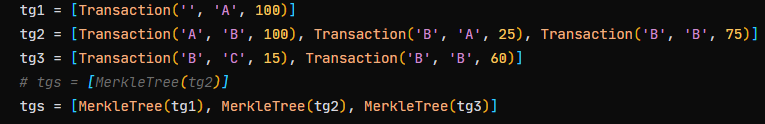
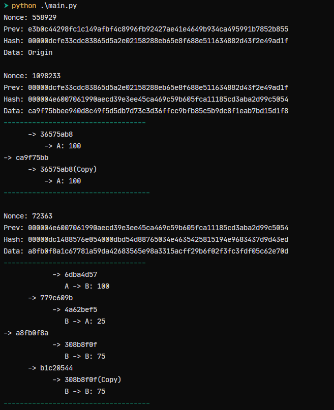
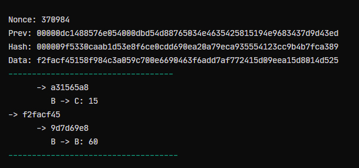
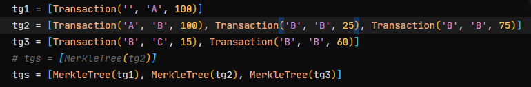
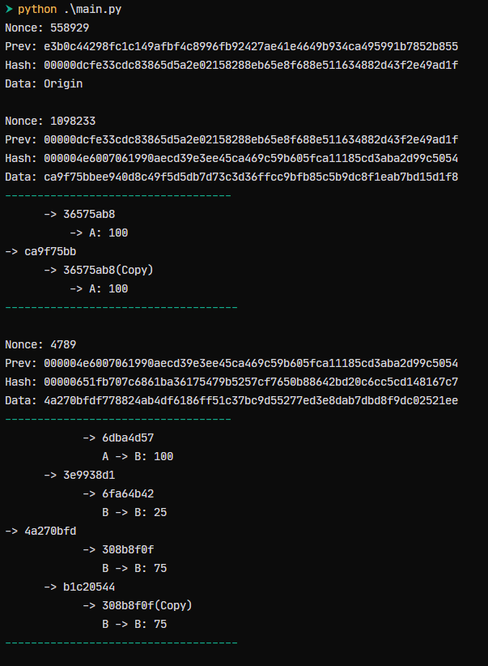
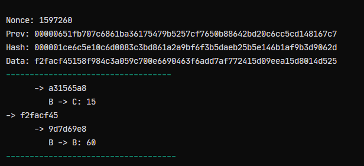
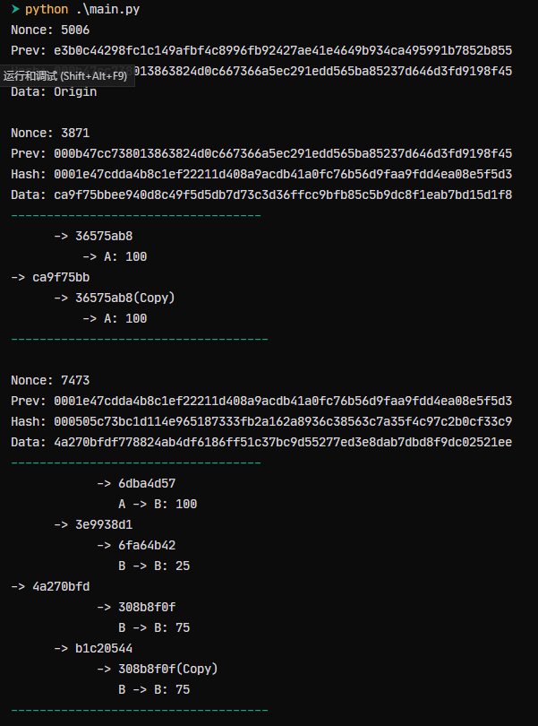
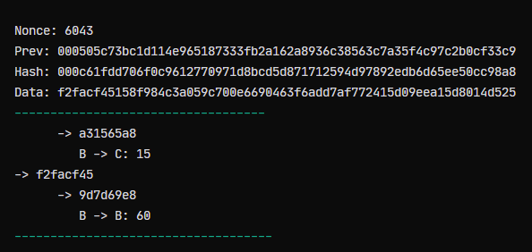

# code running instructinos

使用Transaction类来定义交易的信息

example:`Transaction('A', 'B', 100)`表示A向B发送了100个币。

将同一时间产生的相关交易放入列表中，形成交易链。例如A有100，A向B购买一个价值50的物品，则需要这么使用：

```python
tg = [Transaction('A', 'B', 100), Transaction('A', 'A', 50)]
```

多个交易链需要经过默克尔树进行压缩，将交易列表放入MerkleTree中，将所有的默克尔根放入列表中模拟交易池，如下：

```python
tgs = [MerkleTree(tg1), MerkleTree(tg2), MerkleTree(tg3)]
```

使用Chain类来模拟产生区块和上链的过程，Chain中输入区块的工作量，如下：

```python
chain = Chain(20) # 代表这个区块链是20个比特的工作量

for i, tg in enumerate(tgs):
    data = tg
    chain.add_to_pool(data)
    chain.mine()
    print_blocks(chain.blocks[i + 1], is_first=False)
```

print_blocks函数是输出区块的信息，定义如下：

```python
def print_blocks(block: Block, is_first=False):
    print("Nonce:", block.nonce)
    print("Prev:", block.previous_hash.hexdigest())
    print("Hash:", block.hash.hexdigest())
    print("Data:", block.data)
    if not is_first:
        success("-----------------------------------")
        block.data.printTree()
        success("------------------------------------")
        
    print("")
```


首先假设我们有如下几个交易需要处理：

交易1： A被奖励100
交易2： A向B转移100；B向A转移25；B向B转移75
交易3： B向C转移15；B向B转移60

那么我们的调用方法就是这个样子的：



此时我们使用工作量为20比特的工作量进行挖矿，产生的输出如下：





默克尔中的哈希值只去了前8位方便显示。输出的所有的哈希值都是16进制表示，也就是4个比特表示一个16进制。此时我们发现，所有的区块的当前哈希值的前五位都是0，代表工作量证明成功。

此时我们尝试更改交易2中的一个数字，将“B向A转移25”改成”B向B转移25“，此时我们再来看输出：






我们可以发现从第二个交易开始，所有的哈希值都发生改变了，说明当更改一个信息时，区块内所有的哈希值都会发生改变。

----------------------------

当我们尝试一个稍微短一点的工作量，经它改成12比特，表示这条区块链上的区块哈希值的前3个十六进制都会是0

我们查看结果来验证一下：





